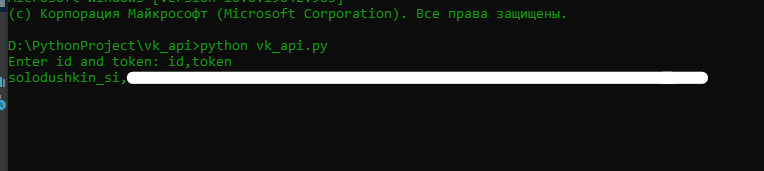
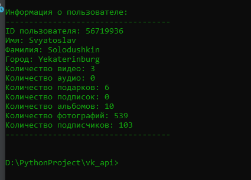

# vk_api
Утилита работает с API vk.com и предоставляет краткую информацию о пользователе  
Для запуска необоходимо  `python vk_api.py`  

Указать id пользователя и токен приложения   

   

Далее информация по выбранному пользователю  

   

